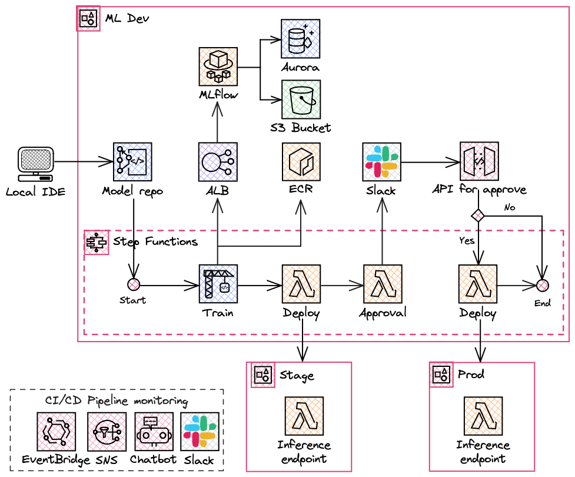

# Serverless MLOps pipeline for multi-account deployment with Step Functions and Terraform
**Table of Contents**

- [Pipeline requirements](#pipeline-requirements)
  * [Problem Context](#problem-context)
  * [Constraints](#constraints)
  * [Requirements](#requirements)
- [Proposed solution](#proposed-solution)
  * [Architecture diagram](#architecture-diagram)
  * [Deployment](#deployment)

## Pipeline requirements

### Problem Context

The data science team wants to develop models in the local environment because they use different tools for development. Also, they want to deploy models to AWS automatically after commit. They prefer to approve models and get notifications about the progress via the Slack channel.

### Constraints

- AWS is the preferred cloud provider

### Requirements

- **R-1** Application should deploy models after new code is committed
- **R-2** Application should provide manual approval for deploying to prod
- **R-3** Application should provide Model registry capabilities
- **R-4** Data scientists should have ability to monitor the process in Slack
- **R-5** Solution should be cost-effective

## Proposed solution

> 💡 *Everything in software architecture is a trade-off. First Law of Software Architecture*

### Architecture diagram

---

Proposed workflow:

- Data scientist pushes code to the **CodeCommit** repository main branch. 
- Commit triggers **Step Functions** MLOps workflow. 
- **CodeBuild** step builds and pushes image for model serving to the **ECR** repository.
- **MLflow** service is hosted on **ECS Fargate** behind **Application Load Balancer** and used for model versioning. Remote artifacts storage is powered by **Amazon Aurora MySQL** and **S3**. 
- **Lambda function** step deploys model to inference Lambda function in stage environment. 
- **Lambda function** step sends approval message to **Slack** channel.
- Data scientist approves or rejects model in Slack channel.
- API call is sent to **API Gateway** which sends Task Success to Step Functions.
- **Lambda function** step deploys model to inference Lambda function in production environment. 

Notifications:
- Step Functions status changes are monitored by **EventBridge** rule and sent to the **SNS** topic. 
- **AWS ChatBot** is subscribed to this topic and sends notifications to the chosen Slack channel.

For process testing, you can use sample dataset from [data](data/) and [seed code](seed_code/) folders. 

### Deployment

All infrastructure components are prepared using IaC tool - Terraform.

[Terraform](terraform/) 